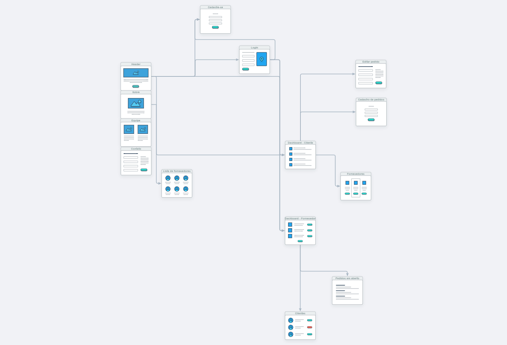
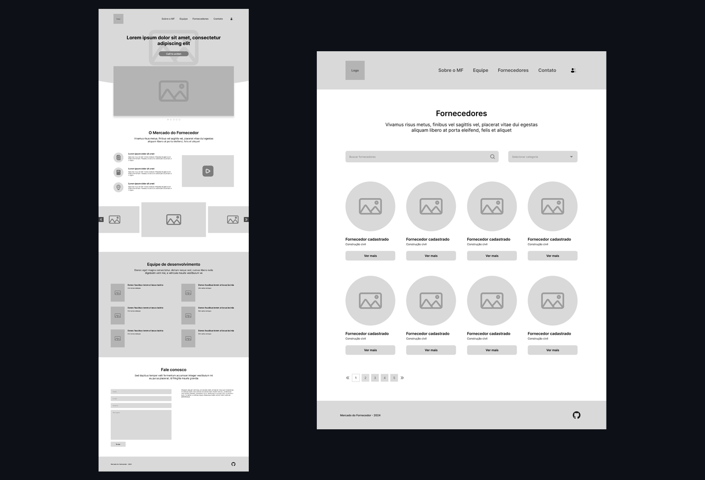
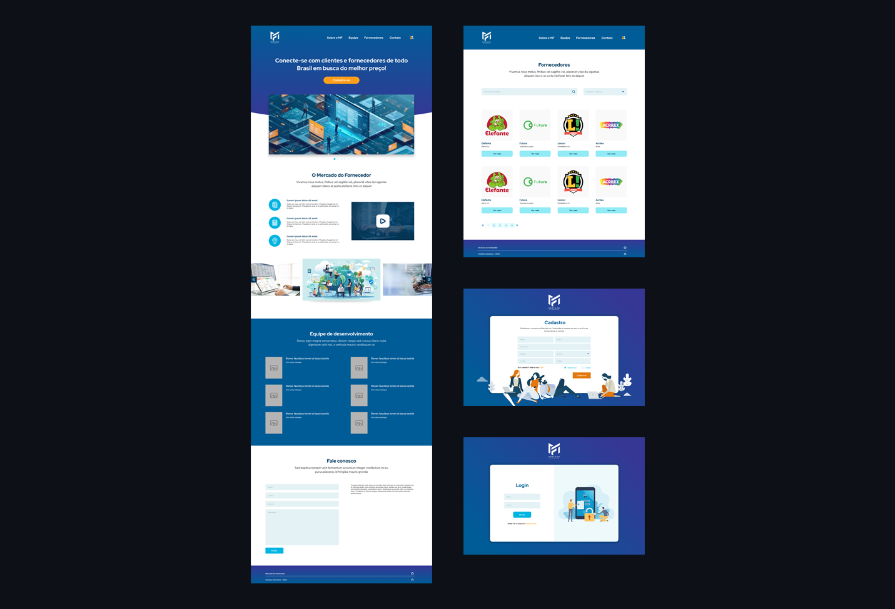

# Projeto de Interface

## User Flow

<figure> 
  Figura 1 - Esquema de user flow desenvolvido pela equipe</figcaption>
</figure> 

## Protótipo

Para esta etapa, a equipe optou por desenvolver dois tipos de protótipos: de média fidelidade e de alta fidelidade. Assim, foi possível visualizar e compreender melhor os elementos necessários para que os requisitos funcionais fossem atendidos, além de facilitar o desenvolvimento da aplicação.

### Protótipo de média fidelidade

Neste protótipo foram estabelecidos os elementos das principais páginas da aplicação - home e fornecedores - e sua disposição. Também foram definidas as disposições das informações nas páginas, além do uso de imagens e vídeos para complementar o projeto.

<figure>
  
  <figcaption>Figura 2 - Protótipos de média fidelidade das páginas Home e Fornecedores</figcaption>
</figure>

### Protótipo de alta fidelidade

Após a validação do protótipo de média fidelidade pelos membros do grupo, foi desenvolvido um protótipo de alta fidelidade. Desta vez, contendo todas as páginas da aplicação, além de detalhes como cores e imagens, que ajudam na compreensão do que se espera do layout da aplicação final.

<figure>
  
  <figcaption>Figura 3 - Protótipos de alta fidelidade de todas as páginas da aplicação</figcaption>
</figure>
 

