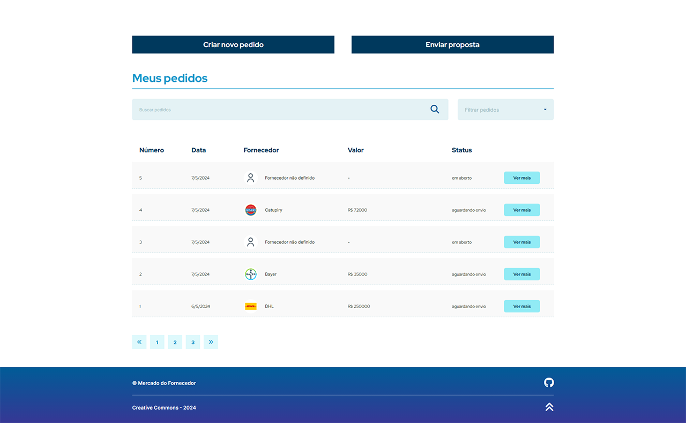
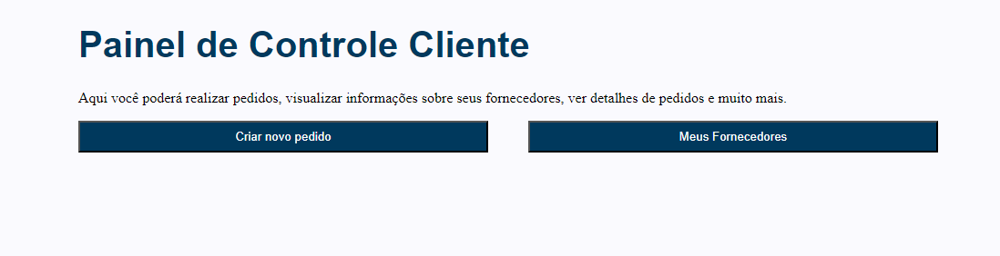
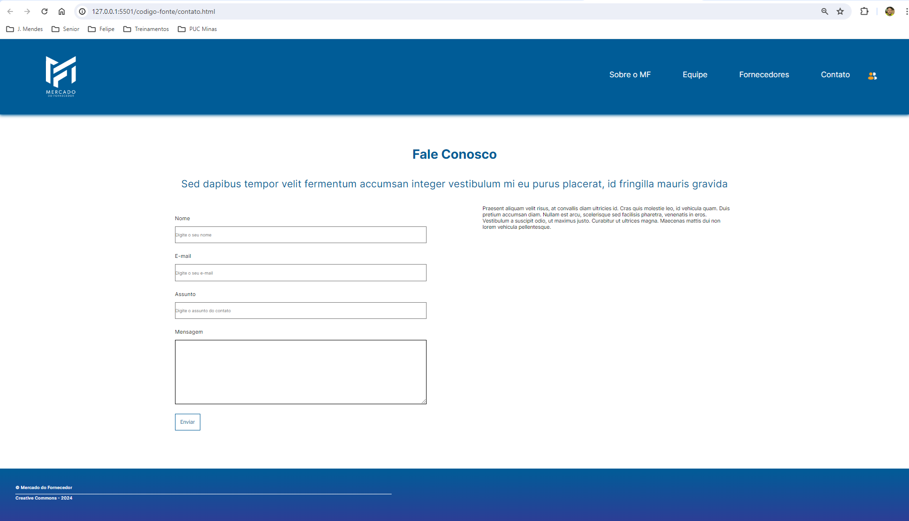
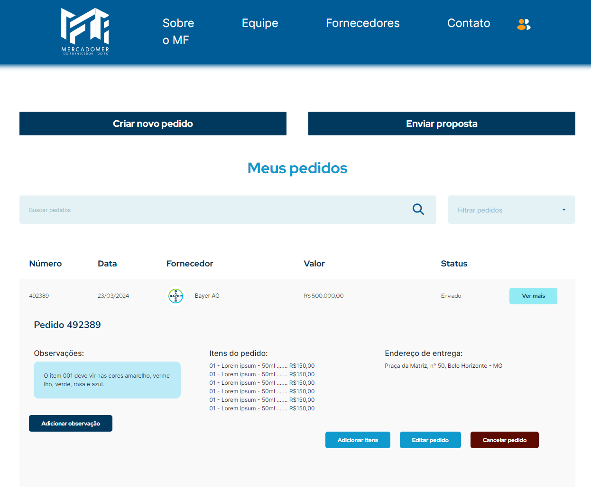
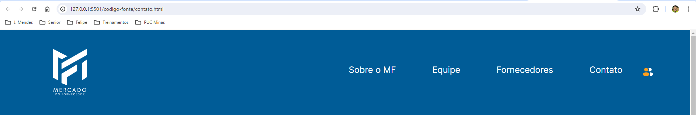
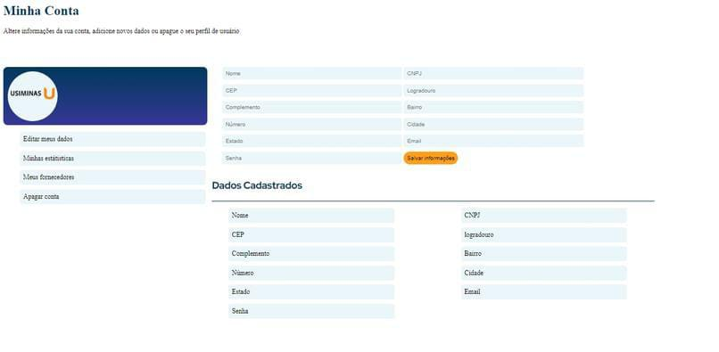
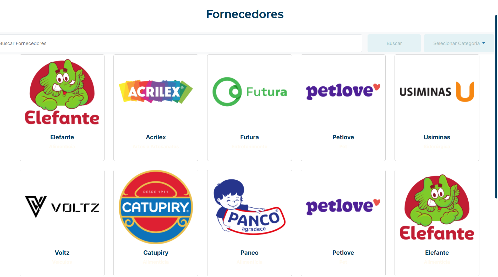

# Programação de Funcionalidades

Implementação da aplicação descritas por meio dos requisitos codificados.

[Utilize a estrutura abaixo para cada funcionalidade entregue na etapa]

### Home - cabeçalho e seção sobre

<figure>
  
  <figcaption>Figura 1 - Imagem do cabeçalho da página home e da seção sobre já implementados na aplicação</figcaption>
</figure>

#### Requisito atendido

N/A - Página não atende a nenhum requisito estabelecido

#### Artefatos da funcionalidade

- Index.html - linhas 31 até 264
- Style.css - Linhas 49 até 483 e 1366 até 1421
- openMenu.js

#### Estrutura de Dados

- <a href="../codigo-fonte/index.html">Index.html - linhas 31 até 264</a>
- <a href="../codigo-fonte/css/style.css">Style.css - Linhas 49 até 483 e 1366 até 1421</a>
- <a href="../codigo-fonte/js/openMenu.js">openMenu.js</a>

#### Instruções de acesso

Para acessar a página, visite o link abaixo:

- <a href="https://icei-puc-minas-pmv-ads.github.io/pmv-ads-2024-1-e1-proj-web-t3-equipe05-mercado-fornecedor/codigo-fonte/" target="_blank">Home da aplicação</a>

#### Responsável

Lorena Marta Martiniana de Paula

### Cadastro de usuário - apenas JavaScript 

<figure>
  
  <figcaption>Figura 2 - Imagem da página de cadastro do usuário</figcaption>
</figure>

#### Requisito atendido

N/A - Página não atende a nenhum requisito estabelecido

#### Artefatos da funcionalidade

- Cadastro.js

#### Estrutura de Dados

- <a href="../codigo-fonte/js/cadastro.js">Cadastro.js</a>

#### Instruções de acesso

Para acessar a página, visite o link abaixo:

- <a href="https://icei-puc-minas-pmv-ads.github.io/pmv-ads-2024-1-e1-proj-web-t3-equipe05-mercado-fornecedor/codigo-fonte/cadastro.html" target="_blank">Cadastro da aplicação</a>

#### Responsável

Lorena Marta Martiniana de Paula

### Lista de pedidos do cliente e cadastro de pedidos

<figure>
  
  <figcaption>Figura 3 - Imagem do painel de controle do cliente contando com a lista de pedidos efetuados pelo usuário e o formulário para cadastro de pedidos</figcaption>
</figure>

#### Requisito atendido

RF-02 - A aplicação deve apresentar campo de status no andamento das requisições

#### Artefatos da funcionalidade

- painelDeControleCliente.html - linhas 50 até 610
- Style.css - Linhas 587 até 1098
- script.js
- api.js
- listarpedidos.js
- cadastrarPedidos.js

#### Estrutura de Dados

- <a href="../codigo-fonte/painelDeControleCliente.html">Index.html - linhas 50 até 610</a>
- <a href="../codigo-fonte/css/style.css">Style.css - Linhas 587 até 1098</a>
- <a href="../codigo-fonte/js/script.js">Script.js</a>
- <a href="../codigo-fonte/js/api.js">Api.js</a>
- <a href="../codigo-fonte/js/listarpedidos.js">listarpedidos.js</a>
- <a href="../codigo-fonte/js/cadastrarPedido.js">cadastrarPedido.js</a>

#### Instruções de acesso

Para acessar a página, visite o link abaixo:

- <a href="https://icei-puc-minas-pmv-ads.github.io/pmv-ads-2024-1-e1-proj-web-t3-equipe05-mercado-fornecedor/codigo-fonte/painelDeControleCliente.html" target="_blank">Página de lista de pedidos</a>

#### Responsável

Lorena Marta Martiniana de Paula

### Interface do cadastro do usuário

<figure>
  
  <figcaption>Figura 4 - Interface da página de cadastro do usuário</figcaption>
</figure>

#### Requisito atendido
N/A - Página não atende a nenhum requisito estabelecido

#### Artefatos da funcionalidade

-cadastro.css

-cadastro.html

#### Estrutura de Dados 

- <a href="https://github.com/ICEI-PUC-Minas-PMV-ADS/pmv-ads-2024-1-e1-proj-web-t3-equipe05-mercado-fornecedor/blob/main/codigo-fonte/cadastro.html">HTML do cadastro</a>

- <a href="https://github.com/ICEI-PUC-Minas-PMV-ADS/pmv-ads-2024-1-e1-proj-web-t3-equipe05-mercado-fornecedor/blob/main/codigo-fonte/css/cadastro.css">CSS do cadastro</a>

#### Instruções de acesso

Para acessar a página, visite o link abaixo:
- <a href="https://icei-puc-minas-pmv-ads.github.io/pmv-ads-2024-1-e1-proj-web-t3-equipe05-mercado-fornecedor/codigo-fonte/cadastro.html" target="_blank">Cadastro da aplicação</a>

#### Responsável

Renato Andrade de Carvalho

### Interface do painel de controle do cliente

<figure>
  
  <figcaption>Figura 4 - Painel de controle do cliente</figcaption>
</figure>

#### Requisito atendido

RF-04	A aplicação deve permitir que o cliente visualize o cadastro de todos os fornecedores para ciência da marca da mercadoria que cotarão

#### Artefatos da funcionalidade

-interfacepedidocliente.css

-interfacepedidocliente.html

#### Estrutura de Dados

- <a href="https://github.com/ICEI-PUC-Minas-PMV-ADS/pmv-ads-2024-1-e1-proj-web-t3-equipe05-mercado-fornecedor/blob/main/codigo-fonte/css/interfacepedidodocliente.css"> CSS do painel</a>

- <a href="https://github.com/ICEI-PUC-Minas-PMV-ADS/pmv-ads-2024-1-e1-proj-web-t3-equipe05-mercado-fornecedor/blob/main/codigo-fonte/interfacepedidodocliente.html">HTML do painel</a>

#### Instruções de acesso

Para acessar a página, visite o link abaixo:
- <a href="https://icei-puc-minas-pmv-ads.github.io/pmv-ads-2024-1-e1-proj-web-t3-equipe05-mercado-fornecedor/codigo-fonte/interfacepedidodocliente.html" target="_blank">painel de controle do cliente</a>

#### Responsável

Renato Andrade de Carvalho

> **Links Úteis**:
>
> - [Trabalhando com HTML5 Local Storage e JSON](https://www.devmedia.com.br/trabalhando-com-html5-local-storage-e-json/29045)
> - [JSON Tutorial](https://www.w3resource.com/JSON)
> - [JSON - Introduction (W3Schools)](https://www.w3schools.com/js/js_json_intro.asp)
> - [JSON Tutorial (TutorialsPoint)](https://www.tutorialspoint.com/json/index.htm)
>

### Página de Contato

<figure>
  
  <figcaption>Figura 5 - Página de Contato </figcaption>
</figure>

#### Requisito atendido

A página permite que o usuário envie uma mensagem de contato

#### Artefatos da funcionalidade

- contato.html - Linhas 35 a 66
- style.css - Linhas 968 a 1068

#### Estrutura de Dados

- <a href="../codigo-fonte/contato.html">contato.html - linhas 35 até 66</a>
- <a href="../codigo-fonte/css/style.css">Style.css - Linhas 968 até 1068</a>

#### Instruções de acesso

Para acessar a página, visite o link abaixo:

- <a href="https://icei-puc-minas-pmv-ads.github.io/pmv-ads-2024-1-e1-proj-web-t3-equipe05-mercado-fornecedor/codigo-fonte/" target="_blank">Contato</a>

#### Responsável

- Felipe Sauter

> **Links Úteis**:
>
> - [Trabalhando com HTML5 Local Storage e JSON](https://www.devmedia.com.br/trabalhando-com-html5-local-storage-e-json/29045)
> - [JSON Tutorial](https://www.w3resource.com/JSON)
> - [JSON - Introduction (W3Schools)](https://www.w3schools.com/js/js_json_intro.asp)
> - [JSON Tutorial (TutorialsPoint)](https://www.tutorialspoint.com/json/index.htm)

### Detalhes dos Pedidos

<figure>
  
  <figcaption>Figura 6 - Detalhes do Pedido</figcaption>
</figure>

#### Requisito atendido

FR-09 - No perfil de fornecedor, permitir filtragem de todos os pedidos feitos por cliente;

#### Artefatos da funcionalidade

- contato.html - Linhas  134 a 775
- style.css - Linhas 1186 a 1339

#### Estrutura de Dados

- <a href="../codigo-fonte/detalhes-pedido.html">detalhes-pedido.html - linhas 134 até 775</a>
- <a href="../codigo-fonte/css/style.css">Style.css - Linhas 1186 até 1339</a>

#### Instruções de acesso

Para acessar a página, visite o link abaixo:

- <a href="https://icei-puc-minas-pmv-ads.github.io/pmv-ads-2024-1-e1-proj-web-t3-equipe05-mercado-fornecedor/codigo-fonte/" target="_blank">Detalhes Pedido</a>

#### Responsável

- Felipe Sauter

> **Links Úteis**:
>
> - [Trabalhando com HTML5 Local Storage e JSON](https://www.devmedia.com.br/trabalhando-com-html5-local-storage-e-json/29045)
> - [JSON Tutorial](https://www.w3resource.com/JSON)
> - [JSON - Introduction (W3Schools)](https://www.w3schools.com/js/js_json_intro.asp)
> - [JSON Tutorial (TutorialsPoint)](https://www.tutorialspoint.com/json/index.htm)

### Cabeçalho e Rodapé

<figure>
  
  <figcaption>Figura 7 - Detalhes do Pedido</figcaption>
</figure>
<figure>
  
  <figcaption>Figura 8 - Detalhes do Pedido</figcaption>
</figure>

#### Requisito atendido

NA - Página não atende nenhum requisito estabelecido

#### Artefatos da funcionalidade

- contato.html - Linhas  12 a 33
- style.css - Linhas 1072 a 1119

#### Estrutura de Dados

- <a href="../codigo-fonte/detalhes-pedido.html">contato.html - linhas 12 até 33</a>
- <a href="../codigo-fonte/css/style.css">Style.css - Linhas 12 até 33</a>

#### Instruções de acesso

Para acessar a página, visite o link abaixo:

- <a href="https://icei-puc-minas-pmv-ads.github.io/pmv-ads-2024-1-e1-proj-web-t3-equipe05-mercado-fornecedor/codigo-fonte/" target="_blank">Contato</a>

#### Responsável

- Felipe Sauter

## Interface Minha Página
<figure>
  
  <figcaption>Figura 9 - Minha Conta </figcaption>
</figure>

## Artefatos e funcionalidade

codigo-fonte/css/minhaconta.css
codigo-fonte/minhaconta.html

## Estrutura dos dados 
- <a href="https://github.com/ICEI-PUC-Minas-PMV-ADS/pmv-ads-2024-1-e1-proj-web-t3-equipe05-mercado-fornecedor/blob/main/codigo-fonte/minhaconta.html">html minha conta</a>
- <a href="https://github.com/ICEI-PUC-Minas-PMV-ADS/pmv-ads-2024-1-e1-proj-web-t3-equipe05-mercado-fornecedor/blob/main/codigo-fonte/css/minhaconta.css">css minha conta</a>

### Instruções de acesso

Para acessar a página, entre no link abaixo:
- <a href=" https://github.com/ICEI-PUC-Minas-PMV-ADS/pmv-ads-2024-1-e1-proj-web-t3-equipe05-mercado-fornecedor/blob/main/codigo-fonte/minhaconta.html" target="_blank">página minha conta</a>

### Responsável 

Safira Gabriele Garcia da Silva

> **Links Úteis**:
>
> - [Trabalhando com HTML5 Local Storage e JSON](https://www.devmedia.com.br/trabalhando-com-html5-local-storage-e-json/29045)
> - [JSON Tutorial](https://www.w3resource.com/JSON)
> - [JSON - Introduction (W3Schools)](https://www.w3schools.com/js/js_json_intro.asp)
> - [JSON Tutorial (TutorialsPoint)](https://www.tutorialspoint.com/json/index.htm)

### Apresentação da equipe - Home

<figure>
  
  <figcaption>Figura 10 - Apresentação da equipe de desenvolvimento</figcaption>
</figure>

#### Requisito atendido
N/A - Página não atende a nenhum requisito estabelecido

#### Artefatos da funcionalidade

-style.css - Linhas 1246 até 1289
-index.html - Linhas 265 até 306

#### Estrutura de Dados 

- <a href="../codigo-fonte/index.html">Index.html - linhas 265 até 306</a>
- <a href="../codigo-fonte/css/style.css">Style.css - Linhas 1246 até 1289</a>

#### Instruções de acesso

Para acessar a página, visite o link abaixo:
- <a href="https://icei-puc-minas-pmv-ads.github.io/pmv-ads-2024-1-e1-proj-web-t3-equipe05-mercado-fornecedor/codigo-fonte/cadastro.html" target="_blank">Cadastro da aplicação</a>

#### Responsável

Otavio Stefanine Nunes Soutelo

### Tabela de fornecedores

<figure>
  
  <figcaption>Figura 11 - Apresentação de fornecedores</figcaption>
</figure>

#### Requisito atendido
N/A - Página não atende a nenhum requisito estabelecido

#### Artefatos da funcionalidade

-fornecedores.css 
-fornecedores.html 

#### Estrutura de Dados 

- <a href="../codigo-fonte/fornecedores.html">Fornecedores.html</a>
- <a href="../codigo-fonte/css/fornecedores.css">fornecedores.css</a>

#### Instruções de acesso

Para acessar a página, visite o link abaixo:
- <a href="https://icei-puc-minas-pmv-ads.github.io/pmv-ads-2024-1-e1-proj-web-t3-equipe05-mercado-fornecedor/codigo-fonte/fornecedores.html" target="_blank">Fornecedores disponiveis</a>

#### Responsável

Otavio Stefanine Nunes Soutelo
